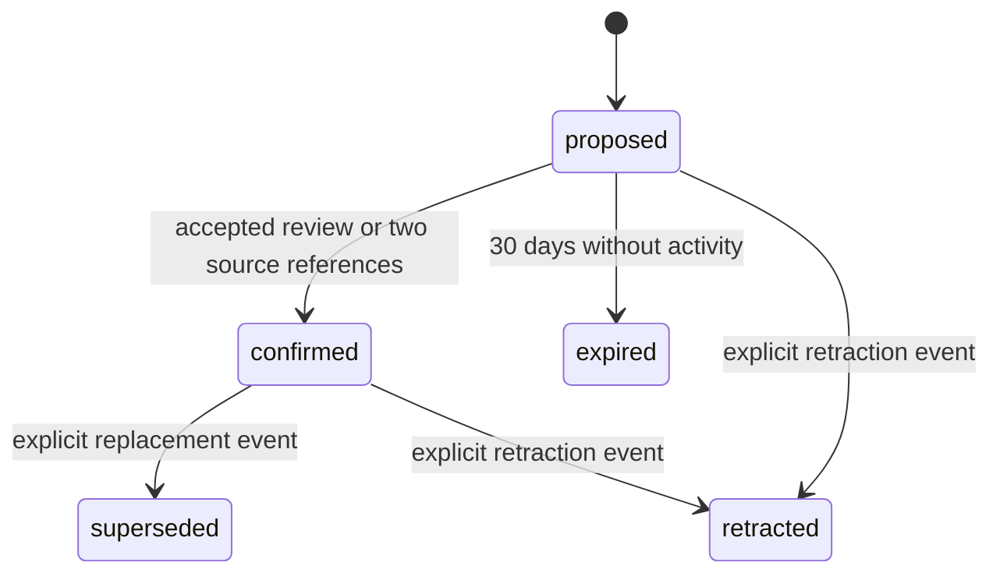

# agent-memory-lifecycle

An evidence-aware lifecycle for agent memory.

AI systems need context to be useful. They also need a way to distinguish a useful lead from a trusted fact. This reference implementation keeps new claims proposed until they are confirmed by a review or by corroborating sources.

It is designed for teams that want agents to retain operational context without silently treating every message, document, or retrieval as true.

## The lifecycle



## See it in action

A customer-success manager is onboarding a new enterprise account. A support ticket says that contractor access requires manager approval.

Before, the manager searches old tickets, a security runbook, and the customer's configuration files each time the question comes up. An assistant may remember the ticket, but it cannot show whether that information is current or authoritative.

With this lifecycle:

1. The ticket creates a proposed memory: `contractor access requires manager approval`.
2. A security runbook and a signed customer access matrix independently support the same claim.
3. The memory becomes confirmed, and an assistant can use it later with the supporting source references attached.
4. If a contract amendment changes the rule, the new claim remains proposed until it is corroborated. A reviewer explicitly supersedes the old rule, preserving the decision history.

The result is straightforward: teams spend less time rechecking scattered information, and high-stakes actions stay tied to evidence.

## How it works

The policy core operates on immutable records and has no network, storage, retrieval, or model dependencies.

- A `MemoryRecord` contains one claim, its evidence, reviews, lifecycle events, and current status.
- An `Evidence` record has a source reference. Repeated evidence from the same source is retained but does not count twice toward confirmation.
- A `Review` is an explicit acceptance or rejection by a named reviewer.
- A proposed memory becomes confirmed after one accepted review or evidence from two distinct source references.
- Proposed memories expire after 30 inactive days by default. Confirmed memories never expire automatically.
- Supersession and retraction are explicit events. The library does not infer semantic conflicts.

```ts
import {
  addEvidence,
  evaluateLifecycle,
  proposeMemory,
} from 'agent-memory-lifecycle';

let memory = proposeMemory({
  id: 'contractor-access',
  claim: {
    subject: 'Acme contractor access',
    predicate: 'requires',
    value: 'manager approval',
  },
});

memory = addEvidence(memory, {
  id: 'source-1',
  sourceRef: 'security-runbook-v4',
  capturedAt: '2026-07-02T00:00:00.000Z',
});

memory = addEvidence(memory, {
  id: 'source-2',
  sourceRef: 'signed-access-matrix-acme',
  capturedAt: '2026-07-03T00:00:00.000Z',
});

memory = evaluateLifecycle(memory);
// memory.status === 'confirmed'
```

## What this is not

This is not a memory database, graph-retrieval engine, vector store, agent framework, or authorization system. It is a small, deterministic policy reference for deciding when an agent memory is ready to be trusted.

## Development

```bash
pnpm install
pnpm run check
```

The check runs TypeScript compilation, linting, and tests.

## Scope

See [PUBLIC-SCOPE.md](PUBLIC-SCOPE.md) for the clean-room boundary and excluded material.

## License

[MIT](LICENSE)
