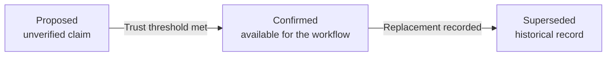

# agent-memory-lifecycle

An evidence-aware lifecycle for agent memory.

AI systems need context to be useful. They also need to distinguish a useful lead from a trusted fact. This clean-room reference implementation keeps new claims proposed until a reviewer accepts them or qualified, independent sources corroborate them.

It is for teams building agents that operate around customer commitments, operational procedures, regulated decisions, or other work where an incorrect remembered detail can create real cost.

## The problem

Most agent memory systems answer one question well: *what information can the model retrieve?* High-stakes systems need to answer three more:

1. Why should the system trust this claim?
2. What should the agent say or do while the claim is still uncertain?
3. What happens when the underlying rule changes or is found to be wrong?

Retrieval answers relevance. It does not establish truth. A document can be easy to retrieve, recent, or frequently used and still be incomplete, outdated, or wrong for the current customer.

This project treats a memory as a **claim plus its decision history**, not as a text chunk with a high retrieval score. Evidence and reviews can support a claim. They do not silently overwrite it.

## The lifecycle

The normal path is intentionally short. A claim starts unverified, earns trust through a defined threshold, and stays current until a person records that a replacement has taken effect.



**Trust threshold:** one accepted human review, or two qualifying evidence records from distinct independence keys.

Two deliberate exits sit outside the normal path:

- A `proposed` memory becomes `expired` after 30 days without activity. Fresh evidence starts a new proposal.
- A `proposed` or `confirmed` memory becomes `retracted` only when a person records an explicit reason.

The state is a policy signal for the surrounding agent, not a confidence score:

| State | What it means | Safe agent behavior |
| --- | --- | --- |
| `proposed` | A plausible claim has been captured, but it is not yet trusted. | Surface it as unverified, ask for confirmation, or continue to gather evidence. |
| `confirmed` | A reviewer accepted it or independent sources corroborated it. | Use it for the workflow, with the supporting references available for inspection. |
| `superseded` | A newer, explicitly named claim replaced it. | Do not use it as the current rule. Preserve it for history and audit. |
| `retracted` | A person explicitly withdrew the claim with a reason. | Do not use it. Preserve the reason and history. |
| `expired` | A proposed claim sat inactive beyond the policy window. | Do not use it as a current operating rule without fresh evidence. |

## Trust rules

The core deliberately makes a few strong choices:

1. **Repeated retrieval is not evidence.** Reads, model citations, and access counts are outside the policy. They show attention, not truth.
2. **A source counts once by authority, not filename.** Each evidence record carries an `independenceKey`. Copies or multiple references from the same underlying authority cannot manufacture corroboration.
3. **Authority is declared.** Evidence records identify their source authority, and the lifecycle policy decides which authority kinds can count toward confirmation.
4. **Human review has an ordered outcome.** Reviews are strictly time-ordered. The latest accepted review confirms a claim; the latest rejection blocks automatic confirmation, even if the evidence threshold is met, until a later review changes that outcome.
5. **Source identity is normalized.** A source reference can be attached once, and independence keys are normalized before corroboration is counted. Formatting differences cannot create a second source or authority.
6. **Confirmed does not mean permanent.** Confirmed memories never decay automatically, but they can only change through an explicit supersession or retraction.
7. **Semantic conflict is not guessed.** A new claim does not invalidate an old one until a person records the replacement relationship and reason.

These rules are intentionally conservative. The policy is designed to make uncertainty visible and recoverable, rather than making an agent sound certain too early.

## A customer-access workflow

Consider a customer-success manager onboarding a new enterprise account. A support ticket says: **contractor access requires manager approval**.

### Before

When a customer asks whether a contractor can be provisioned, the manager searches old tickets, a security runbook, a signed access matrix, and the account configuration. An assistant might recall the support ticket, but it cannot tell the manager whether the ticket was authoritative, whether the rule still applies, or what changed since it was written.

That creates two bad outcomes: people spend time rechecking everything, or they act on an answer that only sounds established.

### With this lifecycle

| Moment | Record state | What the agent can safely do |
| --- | --- | --- |
| A ticket is captured | `proposed` | Say it found a possible rule and show the source. It must not present the rule as settled. |
| The security runbook is attached | `proposed` | Show that one source supports the claim and continue to seek an independent source or review. |
| A signed access matrix is attached from an independent authority | `confirmed` | State the requirement, link the supporting evidence, and support the onboarding workflow. |
| A contract amendment changes the rule | Old record is `superseded`; replacement starts `proposed` | Stop using the old rule as current. Keep both records and the explicit reason for the replacement. |

The practical outcome is not just better recall. It is less time spent rechecking scattered information, clearer handoffs between teams, and a visible basis for every high-stakes answer.

## The decision model

The library separates **deciding** from **transitioning**.

`decideLifecycle` is pure and returns a `LifecycleDecision` explaining the next state, whether a transition is allowed, and why. Its `basis` also exposes the qualified-source count, the policy threshold, and the most recent review outcome, so an integration can log or display the actual decision inputs without parsing the reason string. `evaluateLifecycle` applies that decision by returning a new immutable record with the corresponding event.

The package is intentionally not published to npm. To run this example, clone the repository, run `pnpm run build`, and save it as `example.mjs` at the repository root.

```ts
import {
  addEvidence,
  decideLifecycle,
  evaluateLifecycle,
  proposeMemory,
} from './dist/index.js';

const scope = {
  namespace: 'customer:acme',
  appliesTo: 'contractor-access',
};

const ingestedBy = {
  id: 'policy-ingestion',
  kind: 'integration',
};

let memory = proposeMemory(
  {
    id: 'contractor-access',
    claim: {
      scope,
      subject: 'Acme contractor access',
      predicate: 'requires',
      value: 'manager approval',
    },
  },
  new Date('2026-07-04T09:00:00.000Z'),
);

memory = addEvidence(
  memory,
  {
    id: 'runbook',
    sourceRef: 'security-runbook-v4',
    scope,
    authority: {
      kind: 'approved-policy',
      authorityRef: 'acme-security-governance',
      independenceKey: 'acme-security-team',
    },
    capturedAt: '2026-07-02T00:00:00.000Z',
    recordedBy: ingestedBy,
  },
  new Date('2026-07-04T09:05:00.000Z'),
);

const pending = decideLifecycle(memory);
// pending.nextStatus === 'proposed'
// pending.reason === 'Still proposed: 1 of 2 independent qualified sources ...'

memory = addEvidence(
  memory,
  {
    id: 'access-matrix',
    sourceRef: 'signed-access-matrix-acme',
    scope,
    authority: {
      kind: 'customer-contract',
      authorityRef: 'acme-legal',
      independenceKey: 'acme-legal',
    },
    capturedAt: '2026-07-03T00:00:00.000Z',
    recordedBy: ingestedBy,
  },
  new Date('2026-07-04T09:10:00.000Z'),
);

const decision = decideLifecycle(memory);
// decision.nextStatus === 'confirmed'
// decision.reason === 'Confirmed by 2 independent qualified sources.'
// decision.basis.qualifiedIndependentSources === 2

memory = evaluateLifecycle(memory, {}, new Date('2026-07-04T09:10:01.000Z'));
// memory.status === 'confirmed'
```

This separation gives an integrating system a useful control point: log or display the decision, require an additional approval if needed, then persist the returned record. There are no hidden model calls or background transitions.

## Engineering model

The policy core has validated, serializable models and invariants:

- `Scope`: the namespace and operational context in which a claim applies. Evidence and replacement claims must match it.
- `MemoryRecord`: one canonicalized claim, its evidence, reviews, events, status, and explicit replacement or retraction metadata.
- `Evidence`: a source reference, source scope, authority kind, independence key, capture time, and the actor who recorded it.
- `Review`: a named human acceptance or rejection with an authority reference, reason, review time, and recorded event.
- `LifecyclePolicy`: qualifying evidence authority kinds, the required number of independent sources, and the proposed-memory expiry window.
- `LifecycleDecision`: the current state, next state, permitted automatic transition, human-readable reason, and inspectable decision basis.

`capturedAt` and `reviewedAt` describe when a source or review occurred. Lifecycle events use the time they were **recorded**, so attaching an older document today does not make a current proposal look inactive. Evaluations cannot run against a time before the latest recorded activity. Event IDs are ordered, unique within a record, and returned records are deeply frozen. Record validation also rejects duplicate normalized source references, ambiguous review order, impossible terminal states, unordered events, mismatched canonical claims, and stale activity timestamps.

Supersession requires a real, already-confirmed replacement record in the same scope with a different canonical claim. This does not provide the database transaction that persists both records, but it prevents the policy core from accepting an arbitrary string as a replacement.

## Integration boundary

This repository is intentionally small. An application can put the policy core behind a database, an event stream, a human-review queue, or an agent orchestration layer. The application should treat status as a usage gate:

- `proposed` can inform a search result or a review prompt, but not an authoritative answer or irreversible action.
- `confirmed` can be supplied as operational context, together with its evidence and event history.
- `superseded`, `retracted`, and `expired` should remain inspectable but excluded from the agent's current operating context.

The reference does **not** provide storage adapters, embeddings, graph retrieval, LLM calls, user accounts, APIs, UI, authorization, conflict detection, or a memory database. It also cannot prove that an `independenceKey` or authority reference is truthful. An integrating system must govern and authenticate those identifiers, then persist multi-record supersessions atomically.

## What this demonstrates

For engineering and product leaders, the point is a design posture:

- Make claims first-class rather than treating every retrieved passage as memory.
- Make the basis for trust inspectable at the time an agent uses context.
- Let people, not model heuristics, decide when a policy has been replaced or withdrawn.
- Preserve the history needed to explain why the system gave a high-stakes answer.

This is a reference implementation, not a complete memory platform. Its value is in making the policy surface clear enough to adapt and test before it is embedded in a larger system.

## Development

```bash
pnpm install
pnpm run check
```

The check runs TypeScript compilation, linting, and tests.

## Scope

See [PUBLIC-SCOPE.md](PUBLIC-SCOPE.md) for the clean-room boundary and excluded material. This project is not published to npm in v1.

## License

[MIT](LICENSE)
